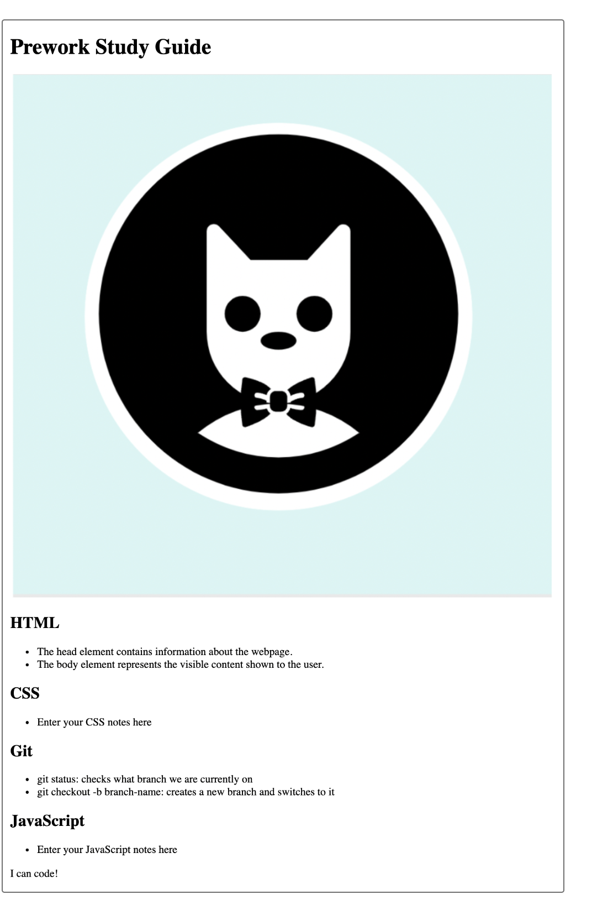
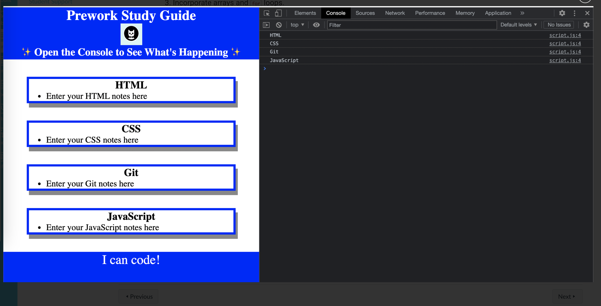

#  Prework Study Guide Webpage

## Description

In this project I had opportunities to practice the tasks that web developers complete every day.
 In the end I built a simple web aplication. 

## Table of Contents 

 To reach the end of the project I worked with the following:

- [HTML](#html)
- [CSS](#css)
- [JavaScript](#javascript)
- The command line, also known as the terminal, Markdown,Git and GitHub

## HTML

HTML is used to create the structure of a webpage. It is made up of elements which work together to provide content and the basic framework for all pages on the web.
I have analyzed and identified `<html>`, `<head>`, `<meta>`, and `<title>` elements in the index.html file in the prework-study-guide repository.

In this section I 
- Completed an HTML file.

- Created a Git feature branch.

- Opened a pull request in GitHub.

- Merged a pull request in GitHub.

- Closed an issue associated with a merged pull request in GitHub.

## CSS

 I used  Cascading Style Sheets (CSS), to add style to our webpage.This is a programming language used by developers to define how webpage content is presented to users.
 In this step :                
- I set up our CSS style sheet for the Prework Study Guide webpage
- linked the style sheet to the HTML
- wrote new declarations for a new CSS rule by designating a class attribute as the selector.
- completed and closed the CSS GitHub issue!

## JavaScript

JavaScript (JS) is a high-level dynamic programming language that allows users to interact with websites.
To finish this part of my project I followed this plan:
- Add a variable to a JavaScript file.
- Add conditional logic using JavaScript.
- Incorporate arrays and for loops.
- Complete the Git flow.

## License
MIT License
